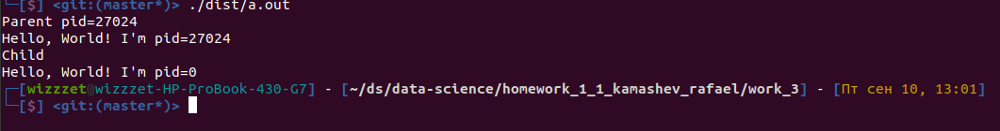

# Домашнее задание Камашева Рафаэля 1.1.
## Упражнение 3*.

>Выясните, что происходит с файлами, открытыми в процессе, когда данный процесс
вызывает системный вызов fork()? Ответ дайте в виде текстового описания и загрузите
его в Робокод

###
Написал программу на С:
```c
#include <stdio.h>
#include <unistd.h>

int main () {
    FILE *fp;
    fp = fopen("result/example.txt", "w");
    fprintf(fp, "First line.\n");

    int pid = fork();
    if (pid == 0) {
        printf("Child\n");
        fprintf(fp, "Сhild line.\n");
    } else if (pid > 0) {
        printf("Parent pid=%i\n", pid);
        fprintf(fp, "Parent line.\n");
    } else {
        printf("Error in fork\n");
    }
    printf("Hello, World! I'm pid=%i\n", pid);

    fclose(fp);
    return 0;
}
```
Вывод:
Судя по логам, видно, что родительский процесс с высокой вероятностью 
выполнился раньше, чем дочерний процесс

Содержимое файла example.txt:
```
First line.
Parent line.
First line.
Сhild line.
```
Порядок записи в файл аналогичен: сначала родительский процесс записал, потом
дочерний. Однако, видно, что строка `First line.` записалась дважды. Так как 
файловый дескриптор был создан раньше форка, то он был скопирован в дочерний 
процесс вместе с буфером, поэтому и запись первой строки задвоилась.
`fflush(fp);` решает эту проблему, сохраняя буфер в файл.

Далее, видно, что `fclose(fp);` вызывается как в родительском процессе,
так и в дочернем, но ничего не падает. Это связано с тем, что fclose удалет не
дескриптор, а ссылки на него, пока они не исчерпаются.

>Выясните, что происходит с файлами,

Надеюсь я правильно понял вопрос задания. Не совсем понятно, дескриптор нужно 
открывать до fork() или после 