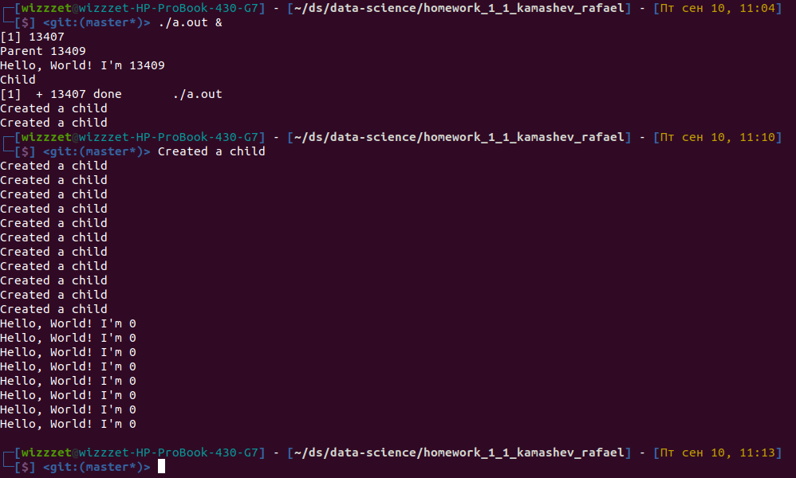
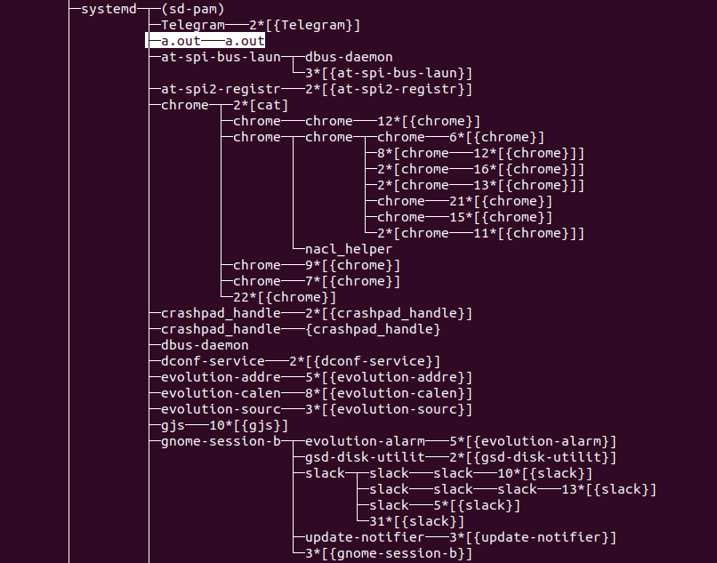
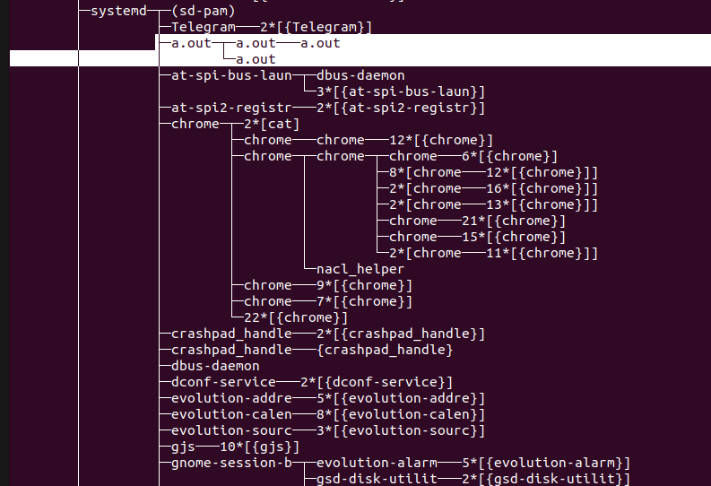
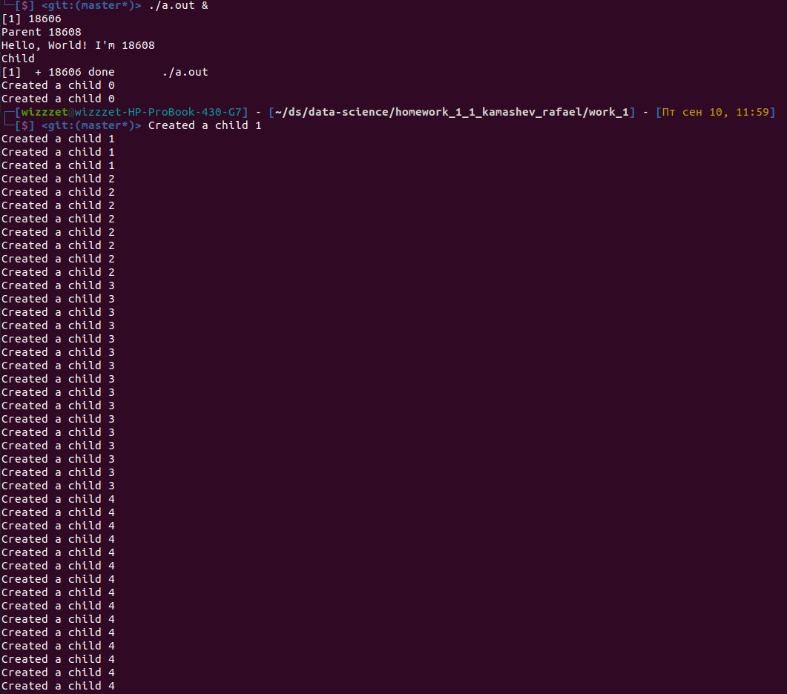
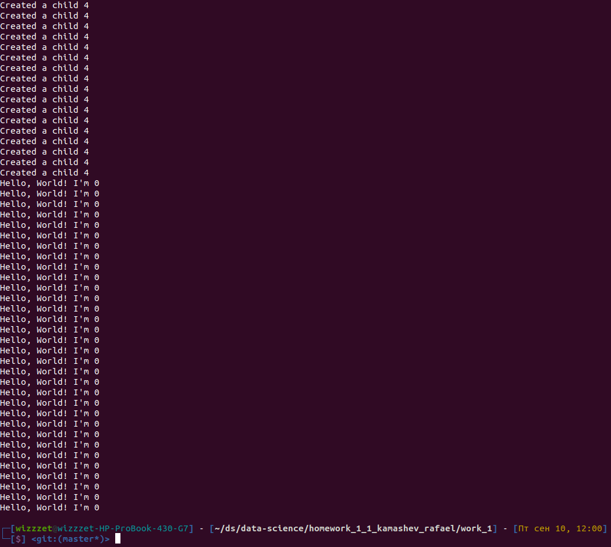
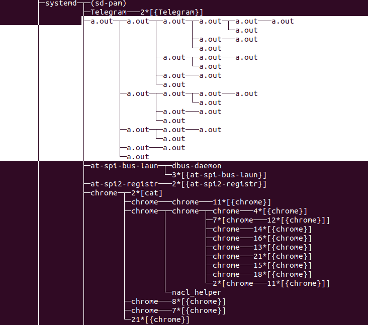

# Домашнее задание Камашева Рафаэля 1.1.
## Упражнение 1.

>Напишите программу (на языке C), которая вызывает fork () в цикле 3 раза и спит (
sleep(..) ) 5 секунд. Запустите программу в фоновом режиме и запустите команду
pstree несколько раз. Посмотрите на вывод и скажите, сколько процессов создано.
Объясните результат. Измените программу так, чтобы она вызывала fork () 5 раз.
Посмотрите, как меняется результат. Сохраните код в Робокод.

###
Создана программа, которая создает процессы в цикле из 3 итераций.

```c
#include <stdio.h>
#include <unistd.h>

const int ITERATIONS = 3;

int main () {
    int pid = fork();
    if (pid == 0) {
        printf("Child\n");
        for (int i = 0; i < ITERATIONS; i++) {
            fork();
            printf("Created a child %i\n", i);
            sleep(5);
        }
    } else if (pid > 0) {
        printf("Parent %i\n", pid);
    } else {
        printf("Error in fork\n");
    }
    printf("Hello, World! I'm %i\n", pid);
    return 0;
}
```
###
Консоль вывода:



По результату выполнения программы видно, что общее количество созданных 
дочерних процессов составило **8**. Однако, сообщений о создании процессов 
больше — 14. Большее количество сообщений объясняется тем, что вывод 
сообщения после fork() происходит и в родительском, и в дочернем процессе.


`pstree` отображает факт создания первого дочернего процесса


Дочерний процесс создает свой собственный дочерний процесс. Вызвано это тем, что
после выполнения `fork()` дочерний процесс продолжил выполняться в цикле и создал
свой собственный подпроцесс. При этом изначальный процесс не завершился 
(хотя таймаут давно вышел), так как ждет завершения дочерних процессов.

### Вариант с 5 итерациями:


В случае с 5 итерациями количество созданных процессов растет в геометрической 
прогрессии. Причина, как и в прошлом случае, связана с рекурсивным выполнением
цикла внутри дочерних процессов, с убывающим количеством шагов на каждой новой
глубине рекурсии, что наглядно видно в выводе `pstree`:

