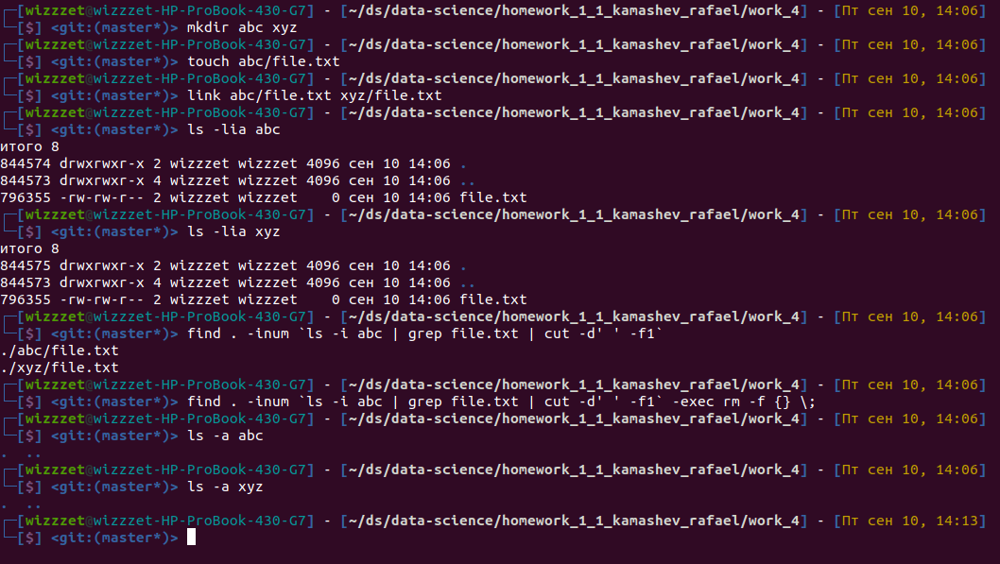

# Домашнее задание Камашева Рафаэля 1.1.
## Упражнение 4.

> Создайте файл file.txt в каталоге abc и получите доступ к этому файлу из каталога xyz
через $ link <source> _some_file.txt
> 
>• Проследить все ссылки на file.txt: $ find <path> –inum inodenumber,
>
>•Удалить все ссылки to file.txt $ find <path> –inum inodenumber -exec rm {} \;
> 
>• Сохранить вывод в файл ex4.txt. Сохраните историю команд в Робокод.

Создал папки, файл и ссылку
```shell
# mkdir abc xyz
# touch abc/file.txt
# link abc/file.txt xyz/file.txt
```

Проверил наличие файла и ссылки - inode одинаковый
```shell
# ls -lia abc
итого 8
844574 drwxrwxr-x 2 wizzzet wizzzet 4096 сен 10 14:06 .
844573 drwxrwxr-x 4 wizzzet wizzzet 4096 сен 10 14:06 ..
796355 -rw-rw-r-- 2 wizzzet wizzzet    0 сен 10 14:06 file.txt

# ls -lia xyz
итого 8
844575 drwxrwxr-x 2 wizzzet wizzzet 4096 сен 10 14:06 .
844573 drwxrwxr-x 4 wizzzet wizzzet 4096 сен 10 14:06 ..
796355 -rw-rw-r-- 2 wizzzet wizzzet    0 сен 10 14:06 file.txt
```

Нашел все ссылки на файл
```shell
# find . -inum `ls -i abc | grep file.txt | cut -d' ' -f1`
./abc/file.txt
./xyz/file.txt
```

Удалил все ссылки и файл по inode
```shell
# find . -inum `ls -i abc | grep file.txt | cut -d' ' -f1` -exec rm -f {} \;
```

Проверил - файлов нет
```
# ls -a abc
.  ..

# ls -a xyz
.  ..
```


