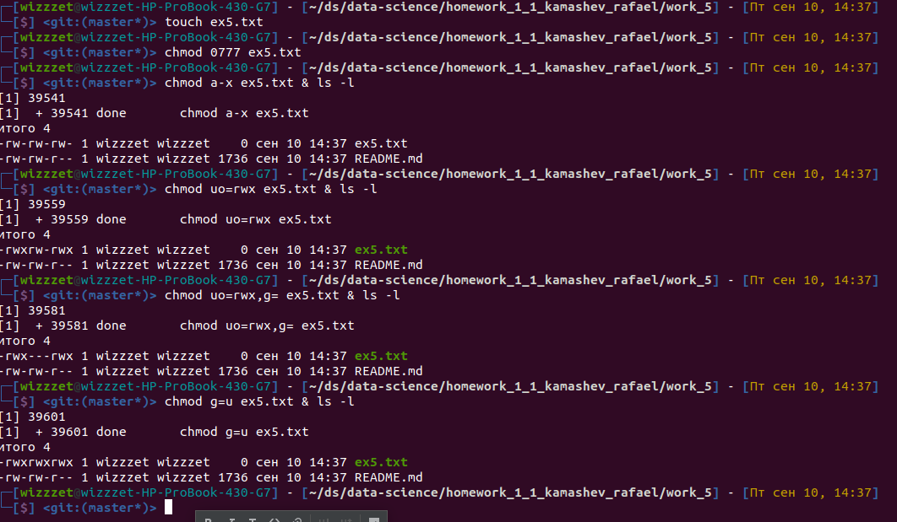

# Домашнее задание Камашева Рафаэля 1.1.
## Упражнение 5.

>Создайте файл ex5.txt и попробуйте следующее:
> 
>• Удалить права на выполнение для всех 
> 
>• Предоставить все права владельцу и другим (т.е. всем, но не группе)
> 
>• Сделать групповые права равными правам пользователя.
> 
>• После каждого шага сохраняйте вывод / ответ в ex5.txt. Сохраните историю команд в
Робокод.

Создал файл
```shell
# touch ex5.txt
# chmod 0777 ex5.txt
```

Убрал права на выполнение для всех
```shell
# chmod a-x ex5.txt & ls -l
итого 4
-rw-rw-rw- 1 wizzzet wizzzet    0 сен 10 14:25 ex5.txt
```

Гарантированно добавил все права для пользователя и остальных, исключая группу
(при любых изначальных правах)
```shell
# chmod uo=rwx ex5.txt & ls -l
итого 4
-rwxrw-rwx 1 wizzzet wizzzet    0 сен 10 14:25 ex5.txt
```

Если при этом нужно еще и группе все права запретить, а не только выдать все права
владельцу и остальным
```shell
# chmod uo=rwx,g= ex5.txt & ls -l
итого 4
-rwx---rwx 1 wizzzet wizzzet    0 сен 10 14:25 ex5.txt
```

Сделал права группы равным правам пользователя
```shell
# chmod g=u ex5.txt & ls -l
итого 4
-rwxrwxrwx 1 wizzzet wizzzet    0 сен 10 14:25 ex5.txt
```

