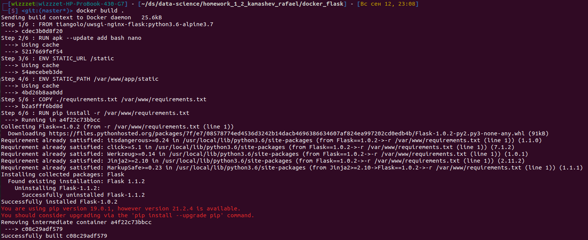
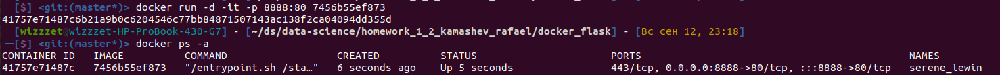
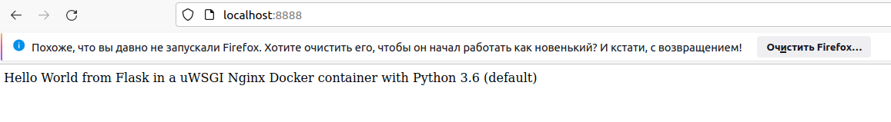
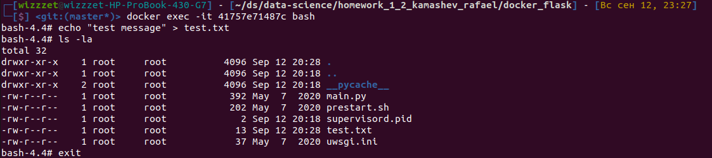
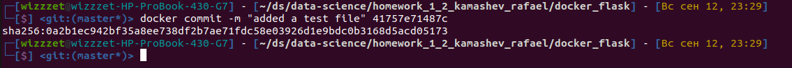
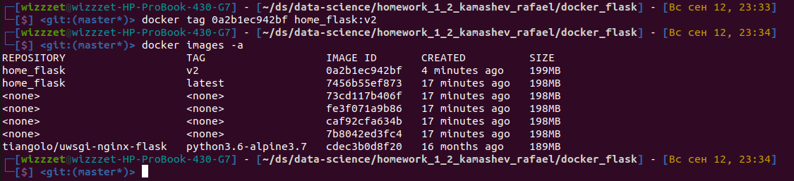
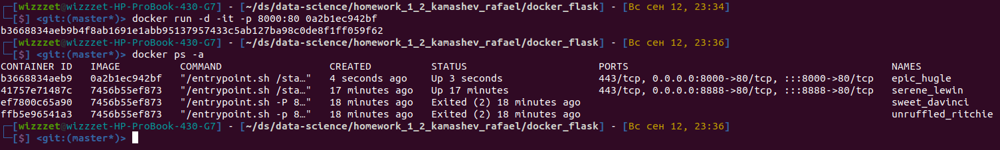
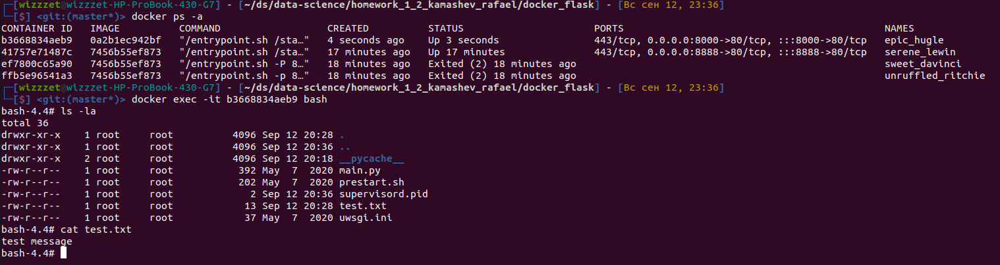
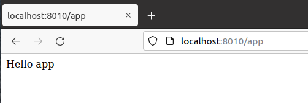

# Домашнее задание Камашева Рафаэля 1.2.
## Упражнение 1 (ЛАЙТ - версия задания)

>Установить Docker, вы вести версию докера с помощью команды docker –v

Результат:
```shell
# docker -v
Docker version 20.10.7, build 20.10.7-0ubuntu1~20.04.1
```

###
>Распакуйте  архив docker_flask и соберите Контейнер с помощью команды build

Результат:


###
>Запустите контейнер на 8888 порту, перейдите в браузере по адресу http://localhost:8888/ и сделайте скриншот результата

Выполняю `docker run`






## Упражнение 2 (ПРО - версия задания)
>Подключитесь к контейнеру с помощью команды exec и создайте 
> там новый текстовый файл test.txt с произвольным содержанием



###
>С помощью команды docker commit создайте новый  Docker образ
> на основе работающего контейнера





###
>Запустите Контейнер из созданного образа, указав другой порт (8000), 
>убедитесь в браузере что контейнер запущен, подключитесь к контейнеру еще раз
> с помощью команды exec и проверьте что созданный вами файл на месте





###
>Перепишите код функции ./app/views.py таким образом, чтобы функция могла 
> принять POST или GET запрос  и принимая на вход текстовую переменную name 
> и возвращала Hello <name> ( return ‘Hello {}’.format(name))

```python
from app import app


@app.route('/<name>', methods=['GET', 'POST'])
def home(name):
    return f'hello {name}'
```

